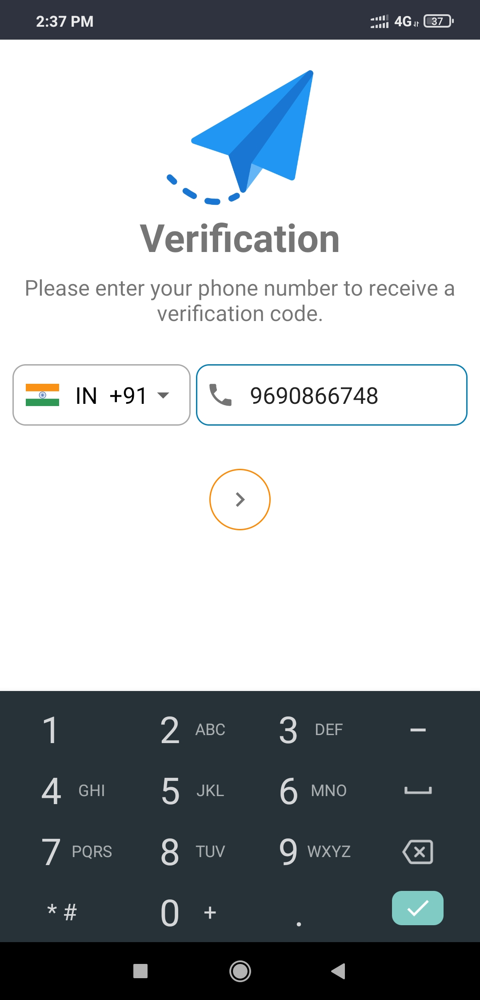
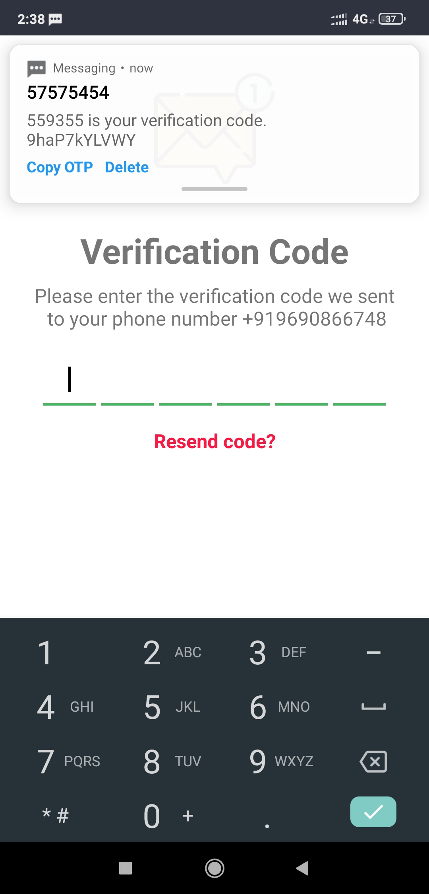
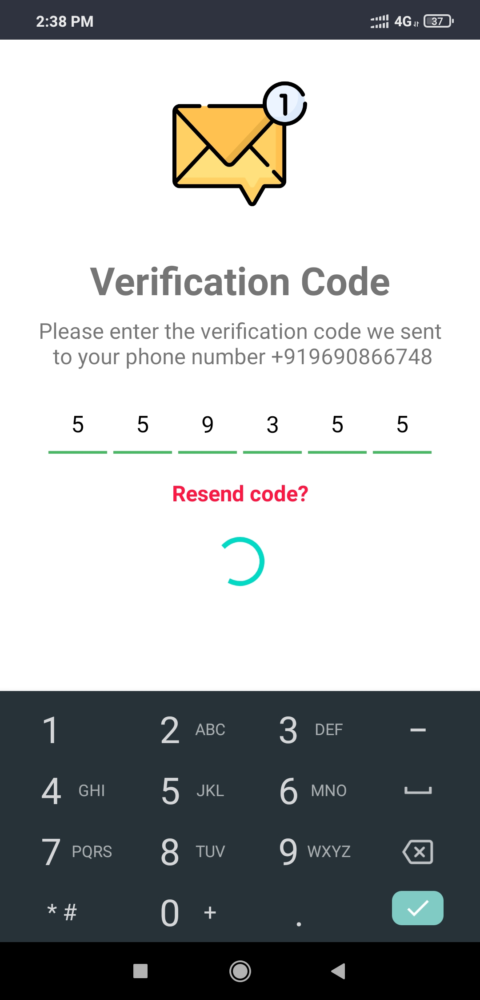
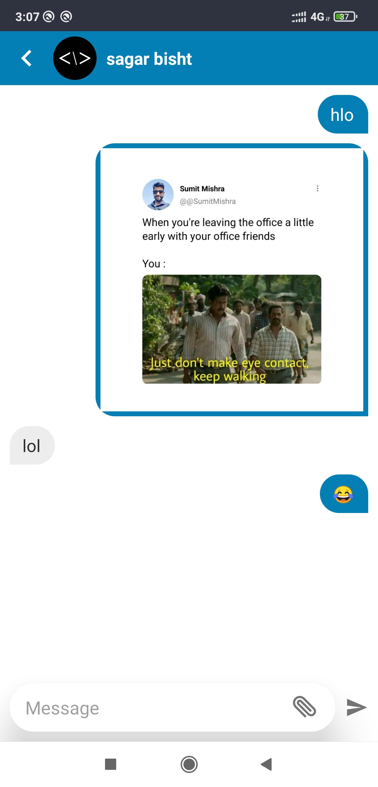
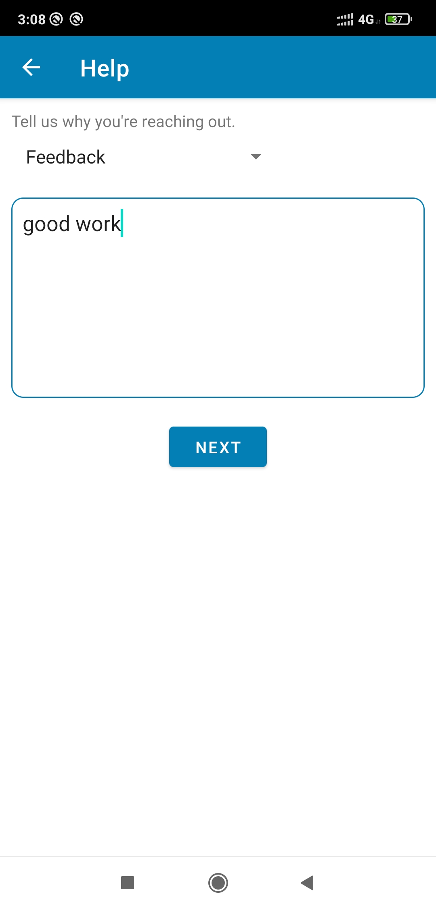
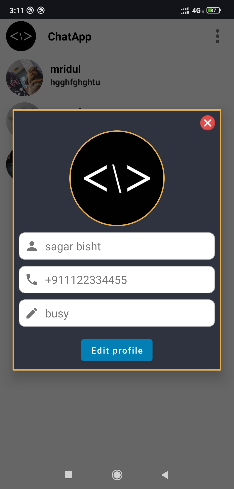
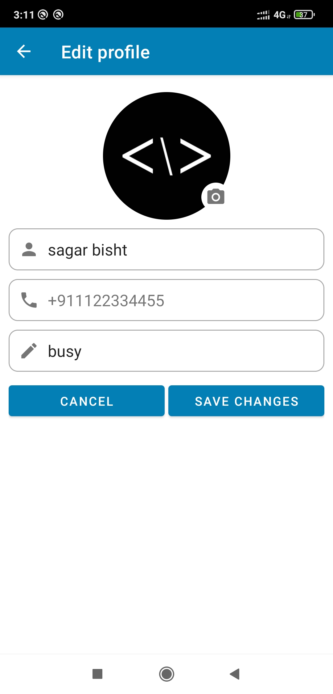

# ChatApp
ChatApp is a real time one to one chat application with phone authentication using firebase.

## Download 

## Features 

- Messaging
  - Send and Receive messages with users
  - Send pictures
- Profile
  - Update your Profile Picture
  - Update your Status
  - View other users profile
- Security
  - Signin with otp
- Presence
  - Online/Offline presence of users

## Screenshots

  
  
  
  
   
  
   

## Credit

  Shimmer Recycler View -> [github.com/sharish/ShimmerRecyclerView](https://github.com/sharish/ShimmerRecyclerView)
  
  Circular Image  View -> [github.com/hdodenhof/CircleImageView](https://github.com/hdodenhof/CircleImageView)
  
  Otp View -> [github.com/mukeshsolanki/android-otpview-pinview](https://github.com/mukeshsolanki/android-otpview-pinview)
  
  Country Code Picker -> [github.com/hbb20/CountryCodePickerProject](https://github.com/hbb20/CountryCodePickerProject)
  

  
